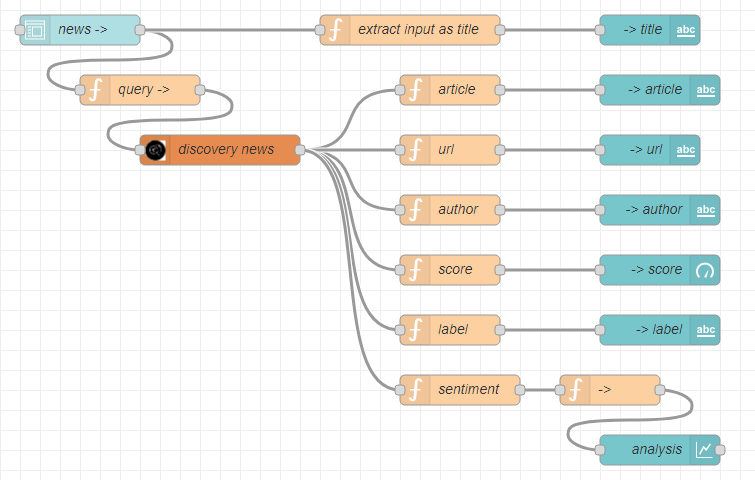

# AI POWERED NEWS SEARCH APP (Level - 1)
[You can check out the documentation here too!](http://sirat.me/llSPS-INT-229-AI-Powered-News-Search-App-Level-1-/)

## About this Project
The aim of this project is to build a news mining application using Node-RED (Node.js) to create a web application,
along with using IBM Cloud for the deployment and IBM Watson's Discovery Service for adding the API for fetching news
and gaining the sentiment of that news article. Also, Slack has been integrated with this service for quick access to the news.


## Important Links
- [x] [Report](Report.pdf)
- [x] [Flow](https://raw.githubusercontent.com/SmartPracticeschool/llSPS-INT-229-AI-Powered-News-Search-App-Level-1-/master/flows.json)
- [x] [Website](https://getthenews.eu-gb.mybluemix.net/ui)
- [x] [Video Presentation](https://youtu.be/vicnBOgkhXs)
- [ ] [Internship and Platform Review Video]() - Coming Soon


## Hosting this Project
There are three ways to host and use this project, as given below:


### A. On a Cloudant (using IBM Cloud and its services)
1. Create an IBM Cloud account.
2. Go to the catalog and add these services - **Discovery** and *Node RED**. Another service would be added automatically for continuous integration.
3. Create a cloudant and assign it 256MB space (which is the maximum amount provided for a Lite account.
4. Go to your **Resource List** and find the Node RED service. Click on it and reduce the assigned space to 128MB.
5. Visit the **App URL** and set up the app with Node RED and it's nodes. Install the Dashboard nodes in the **manage palette** and manage the UI and order of nodes in the dashboard section.
6. You can join nodes and make them recognise each other with function nodes, since you can add JSON to convert the values of the nodes.
7. Install the Discovery Node too, since it's the node that corresponds to the Watson Discovery News Service.
8. Commplete the Node-RED flow and deploy the nodes.



9. Access the UI by taking the app's URL and typing _/ui_ beside it.
eg: `https://getthenews.eu-gb.mybluemix.com/red` can be used to access the nodes used in the application, while `https://getthenews.eu-gb.mybluemix.com/ui` can be used to access the application's User Interface.
10. You're done! Congratulations on deploying your web application to the cloud!


### B. Locally (on your desktop)
1. A simple `git clone https://github.com/ibm/watson-discovery-news` on the git bash terminal would clone the project to your computer. 
2. Following that command with the one below, you can start the application in your browser and view the application in your local browser.
`cd watson-discovery-news`

```
npm install
npm update
npm start
```

3. If you have already deployed it using the cloudant service in IBM as given above, there is no need for this, unless you want to integrate
it with Slack, for which you can follow the steps below.

### C. Integration with Slack
1. Follow the steps above to locally deploy IBM's watson-discovery-news repo on your computer, till `cd watson-discovery-news`.
2. Then, copy the environment file using
`cp env.sample .env`
if you are a Linux/MacOs user
or
`copy env.sample .env`
if you are a Windows user.
3. Create your Watson Discovery Service as done in Procedure #1 above. 
Then, locate the service credentials listed on the home page of your Discovery service and click on the `Download` icon.
4. Open up the downloaded file in any text editor and copy all the credentials.
5. Open up the `.env` file in the folder with the cloned repo, open it and paste all the credentials.
6. You can delete all the extra credentials other than `SLACK_BOT_TOKEN=`.
7. Now, all that is left to do is configuring Slack. Integration is only possible in an existing Slack team, so navigate to `https://<my.slack.com>/apps/manage/custom-integrations`, where `<my.slack.com>` is the workspace you want to add the bot to.
8. From this page (Custom Integrations), selec the **Bots** option.
9. Select the **Add Configuration** button to add a new bot.
10. Enter a unique username for the bot and click on **Add Bot Integration**.
11. Once the bot is created, the API token is generated! Copy this API token and paste it in the .env file, where `SLACK_BOT_TOKEN=` is given.
12. Save the `.env` file, and continue on the terminal by typing these commands:
```
npm install
npm start
```
13. Now, go to your Slack workspace, look for your bot and have a conversation with it!


```
@user> hi
@get_the_news> Hello.
@user> news please
@get_the_news> Hi there! What news are you interested in?
@user>covid19
@get_the_news> You want me to search news about covid19?
@user>yes please!
@get_the_news> *returns three relevant news articles with cover images and source urls successfully*
```
